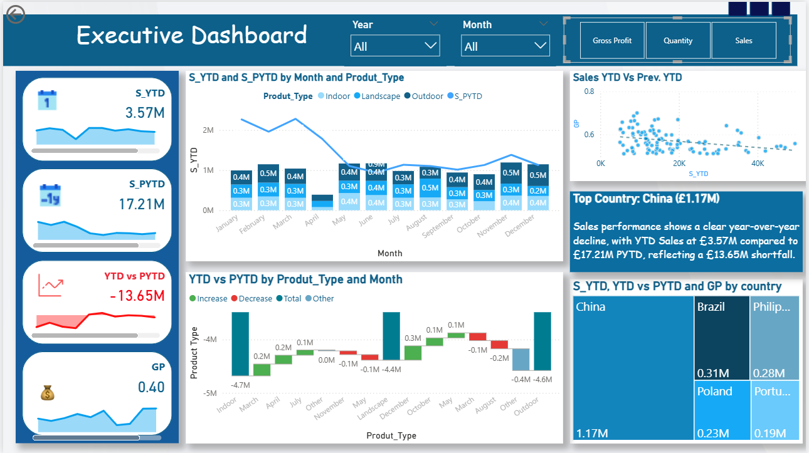
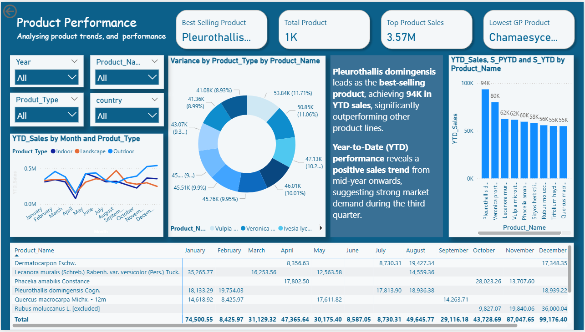
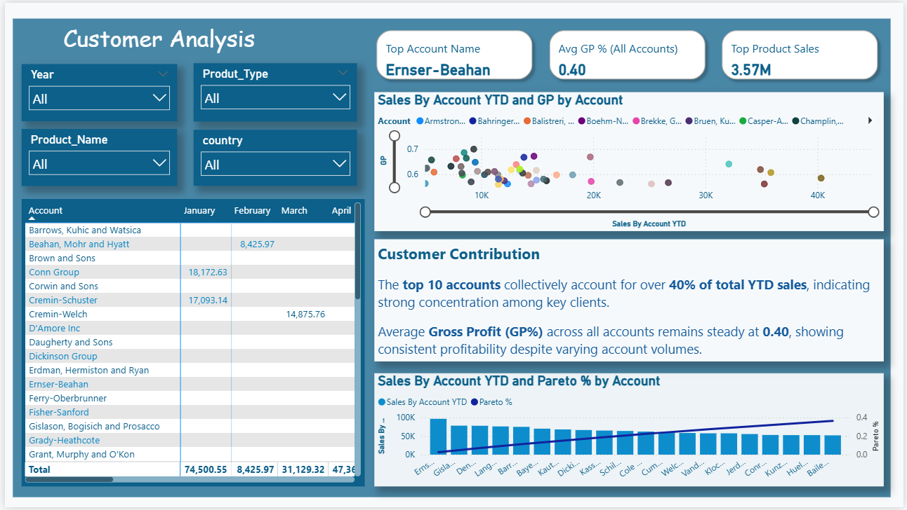
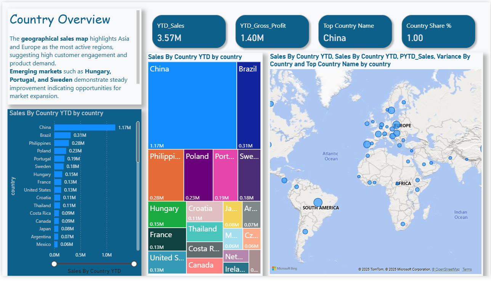
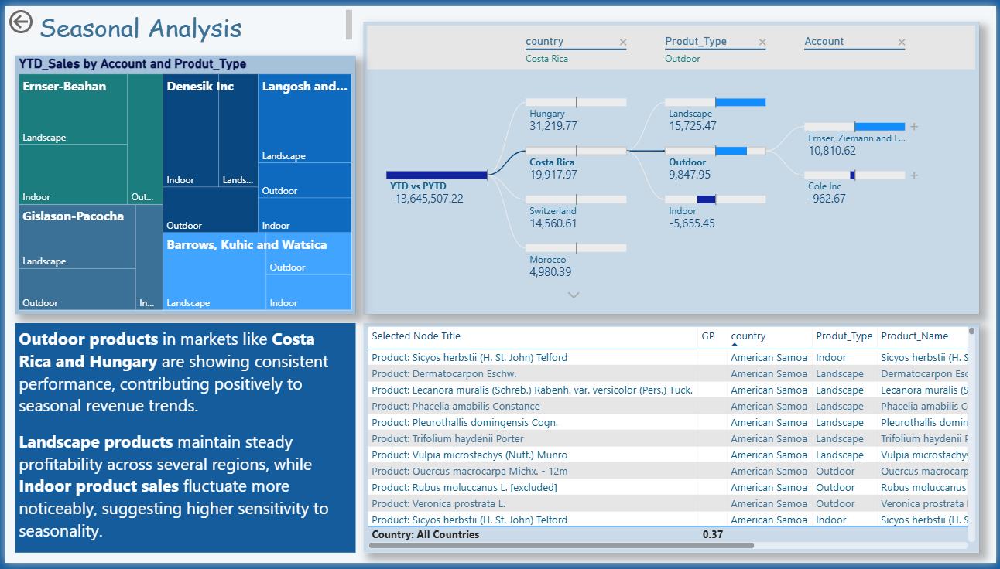

# Power BI Executive Sales Dashboard

This project presents an interactive **Power BI Dashboard** designed to analyze company-wide performance across products, customers, countries, and seasons.

The dashboard enables data-driven decision-making by offering visual insights into **Sales**, **Gross Profit**, and **Year-over-Year trends**.

---

## Tech Stack
- **Tool:** Microsoft Power BI  
- **Data Modeling:** DAX (YTD, PYTD, Variance)  
- **Data Source:** Sample dataset (Sales, Product, Account, Geography)  

---

## Dashboard Pages
1. **Executive Dashboard** – Overall business performance and KPIs.

2. **Product Performance** – Sales trends and profitability by product.

4. **Customer Analysis** – Customer-level contribution and GP%.

6. **Country Overview** – Geographic sales distribution and market insights.

8. **Seasonality Analysis** – Seasonal patterns in product sales and profitability.

---

## Key Insights
- YTD Sales: £3.57M vs £17.21M PYTD → £13.65M shortfall  
- Best-selling product: *Pleurothallis domingensis* (£94K)  
- Top customer: *Ernser–Beahan*  
- Strong growth in **China**, **Hungary**, and **Portugal**  
- **Outdoor & Landscape** products maintain stable performance year-round

---

# PowerBI-project

